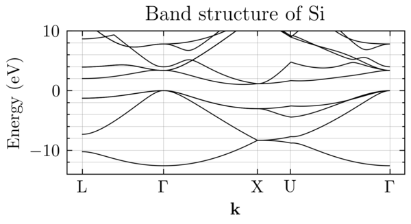
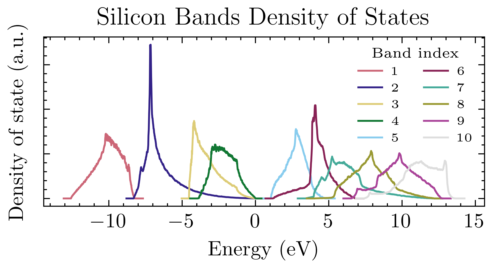
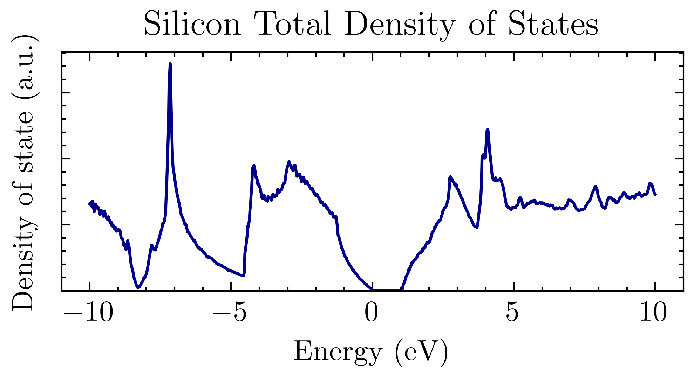

# BzMeshBandsDos

Band structure and DOS computation using empirical pseudopotentials on the full Brillouin-Zone.

---

This repository was initially a fork from : [EmpiricalPseudopotential](https://github.com/aromanro/EmpiricalPseudopotential) of [Adrian Roman](https://compphys.go.ro/empirical-pseudopotential/).

---

## Features

You can do two types of calculations:

### Compute the electronic band structure over a path of high-symmetry points (e.g. $L\Gamma X U K \Gamma$) for a given material, and plot the results 
  

---

### Compute the electronic band structure over all k-points of an input mesh of the Brillouin Zone (or a fraction of it). The result can then be visualized, for example, through iso-energy surface
  

---

### Compute the density of states over the all Brillouin Zone
  
  

## Build and Compilation

### Dependencies

This project relies on these libraries:

-   [Eigen](https://eigen.tuxfamily.org)
-   [GMSH](https://gmsh.info/)
-   [OpenMP](https://www.openmp.org/)
-   [tclap](http://tclap.sourceforge.net/)

You will also need standard packages such as CMake, Make, a C++ compiler, etc.
A **minimal installation** command would look like:  
`sudo apt-get update && sudo apt-get install -y apt-utils cmake g++ libopenmpi-dev`

If you don't have **Eigen** install on your system, the sources will be automatically fetched by CMake when you'll compile the project. You don't need to do anything. [Eigen Website](https://eigen.tuxfamily.org).

The **tclap** library is headers-only and embedded in the sources of the project.
You do not need to install it.

You can install **GMSH** from sources straightforwardly :  
Go wherever you want to install the library and run:  
`git clone https://gitlab.onelab.info/gmsh/gmsh.git && cd gmsh && mkdir build && cd build && cmake -DCMAKE_BUILD_TYPE=Release -DENABLE_BUILD_SHARED=1 -DENABLE_PRIVATE_API=1 .. && make -j 8 shared && make install/fast && cd .. && rm -rf gmsh `  
Find more informations on [GMSH Website](https://gmsh.info/).

### Compilation

*    `git clone https://github.com/RemiHelleboid/EmpiricalPseudopotential.git`  
*    `cd EmpiricalPseudopotential`  
*    `mkdir build && cd build`  
*    `cmake ..`  
*    `make`  

---

## Usage

## Available Material

## Brillouin Zone Meshing
To get the required mesh of the Brillouin Zone, you can use the BZ.py script from the great J. Grebot, there: [fcc-bz-mesh](https://github.com/JGrebot/fcc-bz-mesh).
  