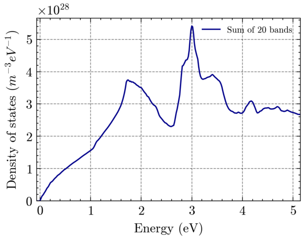

# BzMeshBandsDos 
Band structure and DOS computation using empirical pseudopotentials on the full Brillouin-Zone.

  
  
  

---

This repository was initially a fork from : [EmpiricalPseudopotential](https://github.com/aromanro/EmpiricalPseudopotential) of [Adrian Roman](https://compphys.go.ro/empirical-pseudopotential/).

---

## Features

You can do three types of calculations:

__Compute the electronic band structure over a path of high-symmetry points (e.g. $L \Gamma XWKULWXK \Gamma$) for a given material, and plot the results.__  

---

__Compute the electronic band structure over all k-points of an input mesh of the Brillouin Zone (or a fraction of it). The result can then be visualized, for example, through iso-energy surface.__  

---

__Compute the density of states over the all Brillouin Zone.__  

---

## Build and Compilation

### Dependencies

This project relies on these libraries:

-   [Eigen](https://eigen.tuxfamily.org)
-   [GMSH](https://gmsh.info/)
-   [OpenMP](https://www.openmp.org/)
-   [tclap](http://tclap.sourceforge.net/)

You will also need standard packages such as CMake, Make, a C++ compiler, etc.
A **minimal installation** command would look like:  
`sudo apt-get update && sudo apt-get install -y apt-utils cmake g++ libopenmpi-dev`

If you don't have **Eigen** install on your system, the sources will be automatically fetched by CMake when you'll compile the project. You don't need to do anything. [Eigen Website](https://eigen.tuxfamily.org).

The **tclap** library is headers-only and embedded in the sources of the project.
You do not need to install it.

You can install **GMSH** from sources straightforwardly :  
Go wherever you want to install the library and run:  
`git clone https://gitlab.onelab.info/gmsh/gmsh.git && cd gmsh && mkdir build && cd build && cmake -DCMAKE_BUILD_TYPE=Release -DENABLE_BUILD_SHARED=1 -DENABLE_PRIVATE_API=1 .. && make -j 8 shared && make install/fast && cd .. && rm -rf gmsh `  
Find more informations on [GMSH Website](https://gmsh.info/).

### Compilation

*    `git clone https://github.com/RemiHelleboid/EmpiricalPseudopotential.git`  
*    `cd EmpiricalPseudopotential`  
*    `mkdir build && cd build`  
*    `cmake ..`  
*    `make`  

---

## Usage
### Band structure plot over a __path of high symmetry points__

To plot the band structure over a path $LKW \Gamma XWL \Gamma K$ for a given materials, use:  
`./apps/EmpiricalPseudoPotentialMain -m Si -b 16 -N 2000 -n 10 -r output_dir -j 4 -p LGXWKULWXKG -P`  
* The `-m Si` sets the __material__ on which the band structure is computed to Silicon.
* The `-b 16` option means to compute and export __16 bands__. 
* The `-N 2000` option means that the path will be __discretized in 2000 points__.
* The `-n 10` option specifies the __number of nearest neighbors__ used to compute the band structure. 
* The `-r output_dir` means that the results of the computation will be __stored in the output_dir directory__ (it is created if it does not exist yet).
* The `-j 4` option requires the computation to be run with __parallelization on 4 CPUs.__
* The `-p LGXWKULWXKG ` option specifies the __path__ on which the band structure must be computed. G stands for $\Gamma$.
* The -P option will trigger a call to a __python script that will plot__ the calculated band structure after it has been computed.

___Additional possibilities___
* If you __don't specify the material__ with the `-m SymBol` option, the computation __will be done for all the available materials.__
* If you want to get __all material__ on __many different paths__, use the `-A` option, and don't specify either material or path.
* Use `./apps/EmpiricalPseudoPotentialMain --help` to `display the help` of the program.

___Outputs___
* The energies at each point in the path, for each band, is stored in a file with the form `EEP_Si_nb_bands_16_path_LGXWKULWXKG_size_basis_137.txt`.
* If the `-P` option was set, the plot of the band structured is also stored as .png and .pdf files.

---
### __Band structure computation over a mesh of the Brillouin Zone__

To compute the electronic band structure over a mesh of the Brillouin zone, the command is:  
`./apps/BandsOnBZ -f bz_mesh.msh -m Si -b 12 -n 10 -j 8 -o output_file 
`
* The `-m Si` sets the __material__ on which the band structure is computed to Silicon.
* The `-b 12` option means to compute and export __16 bands__. 
* The `-j 8` option requires the computation to be run with __parallelization on 8 CPUs.__ (OpenMP)
* `-o output_file` can be used to set the name of the __output file__.

___MPI___  
This program has an __MPI version__, for the same arguments as previously, the command is:  
`mpirun -np 8 ./apps/mpiBandsOnBZ -f bz_mesh.msh -m Si -b 12 -n 10 -o output_file`  
* The parallelization is performed over the k-points of the BZ mesh.

___Output___ 
* The result of the computation, i.e. the energy of each band at each vertex of the input mesh, is stored as follows: for each band the energies are store as a gmsh "view" which is the name for the physical data (scalar, vector field, tensor, ...) in the mesh. 

  

---
### __Density of States Computation__
The command to compute the Density of State is:  
` ./apps/DOS_MeshBZ -f bz_mesh_1_fine_EEP_Si_nb_bands_12_path__size_basis_137_all_bands.msh -m Si -b 12 -e 500  -j 8 `
`
* The `-f input_mesh_with_bands.msh` the __mesh file with the energy bands computed__, resulting from the computation with `BandsOnBZ` program.
* The `-m Si` sets the __material__ on which the band structure is computed to Germanium.
* The `-b 12` the number of bands to consider, here: __16 bands.__
* The `-e 500` option sets the __number of energies with whom the energy range of each band is discretized.__ 
* The `-j 8` option requires the computation to be run with __parallelization on 8 CPUs.__
* `-o output_file` can be used to set the name of the __output file.__

---

## Performances

This section reports some performances of the code. We show comparison between parallelization with OpenMP and MPI. The numbers are shown only as a rough estimation, and one should not rely to much on the accuracy here.
### Band structure computation
  

_Band structure computation of Silicon for 16 bands, on a full BZ mesh of around 300K points with local EPM._

For band structure code, the parallelization is done over the k-points.
Computation for every k-points is completely independent from the others, which leads to a very good scaling, as the above image shows. MPI enables to reach higher number of cores, so that the total computation time falls under one minute.

### Density of states computation

Coming soon.

---

## Available Material

## Brillouin Zone Meshing
To get the required mesh of the Brillouin Zone, you can use the BZ.py script from the great J. Grebot, there: [fcc-bz-mesh](https://github.com/JGrebot/fcc-bz-mesh).

---
